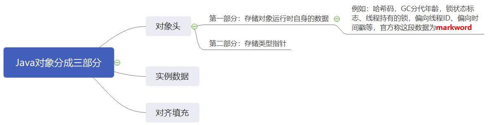

## synchronized 和 volatile

### synchronized

synchronized是Java的一个关键字，可以修饰方法，或者修饰一个代码语句块。可以起到保证方法或者代码块在运行时，同一时刻只有一个方法可以进入到临界区的作用。实现资源的互斥访问。


### synchronized锁的是什么

Java中的每个对象都可以作为锁。具体表现为以下三种形式：

* 对于普通同步方法，锁的是当前实例对象
* 对于静态同步方法，锁的是当前类的Class对象

* 对于同步方法块，锁的是sychronized括号中的对象

  ```java
  public class TestSync {
      // 同步方法
      public synchronized void testA() {}
      // 静态同步方法
      public static synchronized void testB() {}
  
      public static String a = "";
      // 同步代码块
      public void testC() {
          synchronized(a) {}  // 锁的就是a对象
      }
  
      public static void main(String[] args) {
          TestSync testSync1 = new TestSync();
          testSync1.testA();    // 锁的是testSync1这个实例对象
          TestSync.testB();     // 锁的就是TestSync这个类，其实就是testSync1.getClass()返回的那个Class对象
          testSync1.testC();
      }
  }
  ```


### 浅说synchronized底层是如何实现的

* 反编译class文件可以看到，进入方法的时候加了monitorenter，退出出口和异常出口都有monitorexit。其实JVM是基于进入和退出Monitor对象来实现方法同步和代码块同步的。monitorenter就是进入monitor对象，monitorexit就是退出monitor对象。monitorenter指令是在编译后插入到同步代码块的开始位置，而monitorexit是插入到方法结束出和异常处。每个monitorenter必须要有对应的monitorexit与之配对。感觉Lock类的使用很像，相当于上锁和解锁，上锁了之后必须解锁。

* 当一个monitor被持有后，它将处于锁定状态。线程执行到monitorenter指令时，将会尝试获取对象所对应的monitor的所有权，即尝试获得对象的锁。

* 每个对象都有一个monitor与之关联。Java的底层是C++实现的叫做objectmonitor。java实例对象里面记录了指向这个monitor的地址，这个c++的monitor对象里面记录了当前持有这个锁的线程id。

* 当一个线程想要访问同步代码块时，它首先必须得到锁，退出或抛出异常时必须释放锁。当我们使用synchronized关键字的时候，JVM会自动帮我们释放锁。

* 下图是上面那段代码的反汇编中testC方法的截图

  

  

  **小结一下：**

  ​		在Java中，每个对象都能成为锁，其本质是每个对象都有一个monitor对象与之绑定，这个monitor对象是有C++实现的，在Java源码中是看不到的。JVM底层的同步机制是通过进入和退出Monitor对象来实现的。monitorenter指令就是尝试进入monitor对象，也就是线程想要获取锁。monitorexit指令就是释放锁。使用synchronized修饰方法或代码块的时，在编译时期这两条指令（进入和退出指令）就已经被插入到相应的位置了。所以使用synchronized时，不需要我们自己释放锁。

  

  

  

  ### synchornized的锁升级过程

  **前提**

  ​		synchronized在jdk1.6之前一直是重量级锁。重量级锁的意思是如果获取不到这个锁的话，意味着有别的线程在执行这个方法，会马上进入阻塞的状态。这种获取不到锁就马上进入阻塞状态的锁，就称之为重量级锁。

  ​		但是我们仔细想想，如果只有两三个线程争抢一个锁，或者说每个线程每次占用锁的时间都很短的时侯，有必要将得不到锁的线程阻塞吗？很显然没必要吧。本来得不到锁的线程等一小会之后，占有锁的那个线程就释放锁了。就可以重新获取锁了，结果你把它阻塞了。这么做确实不太好，感觉有点小题大做了。在并发量不高，竞争并不激烈的场景下使用重量级锁效率是非常低的。所以在之后的jdk版本，对synchronized进行了优化，在jdk1.6之后引入了 “偏向锁” 和 “轻量级锁” 的概念；级别从低到高依次是：**无锁、偏向锁、轻量级锁、重量级锁**。  

  

  **markword**

  ​		在了解synchronized的锁升级过程之前，有必要了解以下markword。Java中的每个对象都有规范的结构布局，总体分为三部分，如下图，具体参考《深入理解Java虚拟机》

  

  

  对象头中的markword中默认存储对象的hashcode，分代年龄和锁标记位。在运行期间，markword里存储的数据会随着锁标志位的变化而变化。markword可能变化为以下几种数据：

  

  ​		上面这张图可以参考一下，学单片机的时候知道，一个数据的不同位表示的内容是不同的。不同组合表示的内容也是不同的。上面的表示意思也是类似的。各个状态的锁对应的标志位不同。

  

  **无锁态：**

  ​		synchronized最开始的时候是无锁态。对应markword图中绿色部分，也就是当前系统中没有任何线程竞争资源，一般系统初始化之后就是无锁态。

  

  **偏向锁：**

  ​		当第一个线程开始尝试获取锁资源的时候，synchronized便会升级成偏向锁。该锁对象中markword的布局就如上图浅蓝色的部分，该锁对象会在对象头和栈帧中的锁记录里存储偏向的线程ID，以后该线程在进入和退出同步块时，不需要进行CAS操作来加锁和解锁。

  ​		偏向锁，顾名思义。就是偏向于某个线程的锁。当第一个线程访问临界资源的时候，该锁就会把获得锁资源的线程ID存储到markword的指定位置。当以后有线程访问临界资源的时候，只需要简单测试一下对象头中的markword里是否存储着指向当前线程的偏向锁。

  ​		偏向锁产生的原因：Hotspot的作者发现大多数情况下，锁不仅不存在多线程竞争，而且总是同一个线程多次获得锁，为了让线程能够以更低的代价获得锁，所以引入了偏向锁。

  

  **轻量级锁：**

  ​		轻量级锁又称为自旋锁，当有多个线程开始竞争资源的时候，synchronized就会升级成轻量级锁。该锁对象中markword的布局就如上图深蓝色部分的第一行。可以看到有个叫做**Lock Record**的东西。

  ​		**Lock Record**其实是和锁重入有关的，锁重入就是同步方法调用了另外一个同步方法（同一个锁对象）。锁重入就是靠Lock Record来实现的，每个线程要想上锁就需要在自己的线程栈中生成一个Lock Record对象，当发生重入的时候，线程栈中就再生成一个Lock Record对象。Lock Record就记录了到底锁了多少次，一个Lock Record就对应一次monitorenter和monitorexit。

  ​		在轻量级锁的状态下，所有竞争锁的线程会采用CAS的方式将锁对象中markword对应位替换成指向自己Lock Record的指针。如果替换成功，则该线程获得锁。如果失败，则采用自旋的方式获取锁。解锁时，锁对象就会把原本保存起来的markword恢复到对象头中。

  ​		轻量级锁产生的原因：其实前面有提到过，当少量的线程抢占锁时或者每个线程占用锁之后很快就释放了，那么就没必要阻塞线程。所以就让其他争抢锁的线程以自旋的方式在原地打转，等着抢到锁的线程释放锁然后再重新去争抢。所以轻量级锁又叫做自旋锁。

  

  **重量级锁：**

  ​		轻量级锁状态下，如果争抢不到锁的线程自旋了一定的次数之后还争抢不到锁，就说明当前系统中并发量很高了。这个时候synchronized就会升级成重量级锁。因为自旋状态线程是在不断运行的，需要消耗CPU资源，CPU需要不断的切换线程执行，线程之间的切换就是一个很大的开销，所以倒不如升级成重量级锁，将其阻塞，交由操作系统处理。