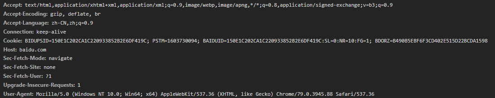
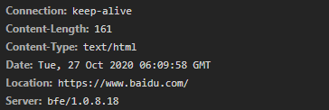
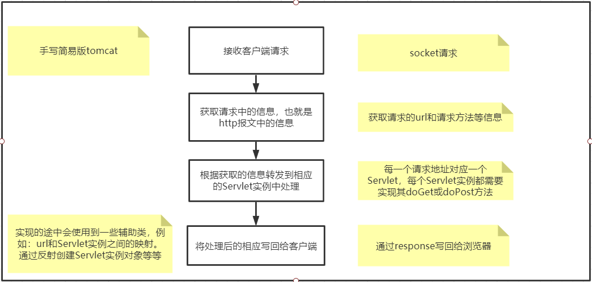
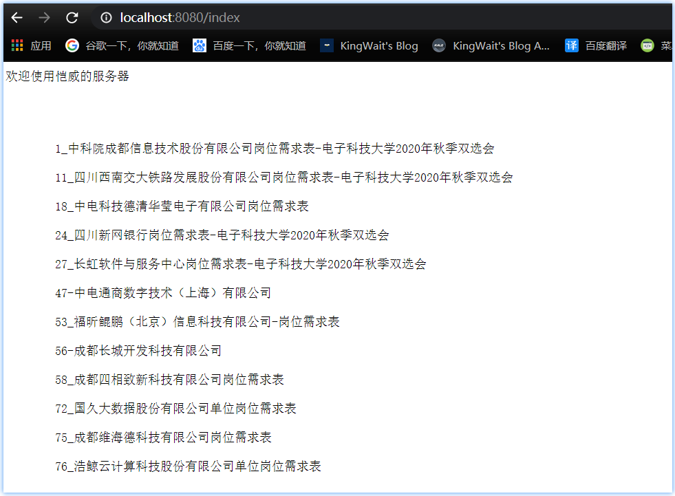

## 手写简易web服务器

### 前置知识

* 了解http协议
* socket编程


### 了解http协议

* web服务器与客户端是使用http通信的，首先我们得了解http协议的报文格式，里面什么字段做了什么事。http分为请求报文和响应报文，这些报文有严格的格式要求。参考图解http


### 请求报文

* 请求报文也是类似key : value键值对的形式

| key                | value                                                        |
| ------------------ | ------------------------------------------------------------ |
| Host               | 本次请求的主机路径                                           |
| User-Agent         | 告诉服务端本次请求客户端所在的平台以及本次请求采用的浏览器类型 |
| Accept             | 指定客户端能够接收的数据类型                                 |
| Accept-Language    | 告诉服务端，浏览器可以识别的语言种类                         |
| Accept-Encoding    | 告诉服务端，浏览器可以接收哪些类型压缩格式数据               |
| 等字段 . . . . . . | 参考图解http                                                 |

* 请求百度的请求报文（chrome浏览器截图）




### 响应报文

|                                    |                      |
| ---------------------------------- | -------------------- |
| 响应协议版本号 状态码 是否成功(ok) |                      |
| Date                               | 响应时间             |
| Content-Type                       | 响应的数据类型       |
| Content-Encoding                   | 响应采用的压缩格式   |
| Content-Length                     | 响应的数据长度       |
| **空行**                           | **一定要记得空一行** |
| 响应数据                           | 响应数据             |

* 请求百度的响应报文




### 服务器架构和流程图

大家应该都学过Java Web，我们可以参考Java Web中的一些标准，使用Servlet处理请求，不同的url对应不同的Servelt实例。

* 为了能够响应并处理不同的url，每个servelt实例对应不同的处理流程，所以我们可以抽象一个**Servlet类**；

* 为了封装请求报文，我们需要设计一个**Request类**；

* 为了封装响应报文，我们需要设计一个**Response类**；

* 想一想Java Web开发中，我们总是需要手动配置servelt，哪个servlet对应哪个url，所以我们需要设计一个**ServletConfig类**，用于读取Servelt的配置信息；

* 当然了，我们需要配置一个主启动类，描述服务器在哪个端口启动，socket开在哪个端口。就叫做**Server类**吧。你可以类比成 Tomcat；

* 还有一些Servelt实例对象，真正处理业务逻辑的类，就叫做**XXXServelt**吧；

  

#### 流程图




* 


**Servlet**

```java
/*
	定义成抽象类，里面有三个方法，service方法会判断请求方式，然后根据请求方式调用doGet或doPost方法
	doGet和doPost是抽象方法，所有Servlet的实例都需要实现这两个方法；
*/
public abstract class Servlet {
    public void service(Request request, Response response) {
        if(request.getMethod().equalsIgnoreCase("post"))
            doPost(request, response);
        else if(request.getMethod().equalsIgnoreCase("get"))
            doGet(request, response);
    }

    protected abstract void doGet(Request request, Response response);

    protected abstract void doPost(Request request, Response response);
    
}
```


**Reqeust**

```java
// 简单起见，只获取Request中的请求方式和请求资源路径
@Data
public class Request {
    private String method;
    private String url;
    public Request(InputStream in) throws Exception {  // socket的inputStream
        BufferedReader br = new BufferedReader(new InputStreamReader(in));
        String httpHead = br.readLine();
        String[] httpArr = httpHead.split(" ");
        method = httpArr[0];
        url = httpArr[1];
    }
}
```


**Response**

```java
// 写响应请求的时候一定要严格遵守http协议的报文规定
@AllArgsConstructor
public class Response {
    private OutputStream out;  // socket的outputStream

    public void write(String content) throws Exception {
        StringBuffer sb = new StringBuffer();
        sb.append("HTTP/1.1 200 OK\n")    	// 声明协议版本号，响应状态码
                .append("Content-Type:application/json; charset=utf-8;\n")  // 告诉浏览器按照json格式解析数据
            	.append("\n")       // 这里千万要记得空一行，http响应报文中，响应头和响应体之间必须要空一行
                .append(content);   // 真正想返回的数据
        out.write(sb.toString().getBytes());   // 写回给客户端
    }
}
```


**ServletConfig**

```java
/**
1、ServletConfig用于说明请求url交给哪个servlet去处理。但是servlet在web服务器启动的时候是还没有实例化的。

2、也就是说代码中没有new Servlet实例，所以需要反射创建Servlet实例。因此，在配置文件中，还需要配置Servlet实例的全限定类型名，用于反射创建对象。

3、为了方便代码的编写，所以定义了一个静态内部类，存储请求路径url和实例处理对象的clazz（servlet实例的全限定类名）

*/
public class ServletConfig {
    // 服务器中一般会很多个请求地址，所以会有多个servlet实例对象，用一个list集合存储起来
    public static List<ServletMapping> servletMappingList = new ArrayList<>();

    // 配置文件是一个properties文件，读取配置文件，获取url和clazz
    static {
        try {
            FileInputStream fis = new FileInputStream("src/main/resources/server.properties");
            Properties properties = new Properties();
            properties.load(fis);
            String url = (String) properties.get("url");
            String clazz = (String) properties.get("class");
            servletMappingList.add(new ServletMapping(url, clazz));
        } catch (Exception e) {
            e.printStackTrace();
        }
    }

    @AllArgsConstructor
    @Getter
    static class ServletMapping {
        private String url;
        private String clazz;
    }
}
```


**Properties配置文件**

```properties
// 就配置了一个Servlet实例，也可以配置多个，参考properties的写法
url=/index
class=com.kingwait.instance.IndexServlet
```


 **Server**

```java

@NoArgsConstructor
public class Server {
    private int port = 8080;   // 服务器默认启动端口
    
    // 存储url和clazz的映射，用于快速获取servlet类名创建对象，具体参考init方法和dispatch方法
    private Map<String, String> servletUrlMapping = new HashMap<>();  

    public Server(int port) {
        this.port = port;
    }

    // 获取配置文件中的servletMapping对象
    public void init() {
        for (ServletConfig.ServletMapping servletMapping : ServletConfig.servletMappingList)
            servletUrlMapping.put(servletMapping.getUrl(), servletMapping.getClazz());
    }

    // 分发请求到对应的servlet实例处理
    public void dispatch(Request request, Response response) throws Exception {
        String clazz = servletUrlMapping.get(request.getUrl());  // 获取Servlet实例全限定类名
        if(clazz != null) {
            // 反射创建对象
            Class<Servlet> servletClass = (Class<Servlet>)Class.forName(clazz);
            Servlet servlet = servletClass.newInstance();
            
            // 调用servic方法处理请求，service方法会根据请求方式自动调用doGet或doPost方法
            servlet.service(request, response);
        }
        else
            response.write("no match servlet");
    }

    public void start() throws Exception {
        ServerSocket ss = new ServerSocket(port);  // 开启通信端口
        init();  // 初始化容器，就是把配置文件中的servlet配置装载到servletUrlMapping
        System.out.println("kingwait's web server is starting, listening on " + port + "...");
        while(true) {
            Socket socket = ss.accept();
            System.out.println("Client connected");
            Request request = new Request(socket.getInputStream());  	   // 拿到请求
            Response response = new Response(socket.getOutputStream());    // 拿到响应
            System.out.println(request);
            dispatch(request, response);  // 分发请求
            socket.close();               // 关闭socket连接
            System.out.println("Client disconnected");
        }
    }

    public static void main(String[] args) throws Exception {
        new Server().start();
    }
}

```


**IndexServlet实例对象**

```java
// 必须要继承Servlet类才能成为一个Servlet
public class IndexServlet extends Servlet {
    @Override
    protected void doGet(Request request, Response response) {  // 实现doGet方法
        try{
            StringBuffer sb = new StringBuffer();
            // 随便写了一个文件给浏览器，整理学校双选会的文件
            BufferedReader br = new BufferedReader(new FileReader("C:\\Users\\Yuxer\\Desktop\\ss.txt")); 
            String line = null;
            sb.append("欢迎使用恺威的服务器\n\n\n\n\n");
            while((line = br.readLine()) != null)  
                sb.append("\t" + line + "\n");  // readLine方法是不包含换行符的，所以需要自己加\n
            response.write(sb.toString());		// 通过socket的输出流，写给客户端
        } catch(Exception e) {
            e.printStackTrace();
        }
    }

    @Override
    protected void doPost(Request request, Response response) {}
}
```


**运行结果**




### 总结

* 自己实现一个简易版的服务器还是很有意思的，在这个过程中，能够了解到http协议的一些细节，虽然也还是比较浅显的了解，但是较之前还是更深入了一些，明白了报文的格式，什么字段是什么意思等等。
* 因为是完全自己实现，所以会考虑怎么去设计整体的架构，怎么抽象一个内容，能不能用上一些设计模式，怎么设计一个类等等，可能很高大上，其实我就是随便说说，因为我也没用啥设计模式，也没啥架构，哈哈。不过设计类还是思考了一下的，其实总体参考了一下Java Web，Servlet啊，HttpRequest啊，等等. . . . . .    站在巨人的肩膀上
* 写的过程中其实会在脑海中思考tomcat设计架构，怎么说呢，或许可以更有意识的去理解tomcat，之后去看tomca源码或许就不会那么懵逼。
* 当然这个程序还是有bug的，还有一些异常是直接抛出去的，而且抛的是Exception。为了方便啦，后续再改进。接下来准备去瞧瞧tomcat的源码。

