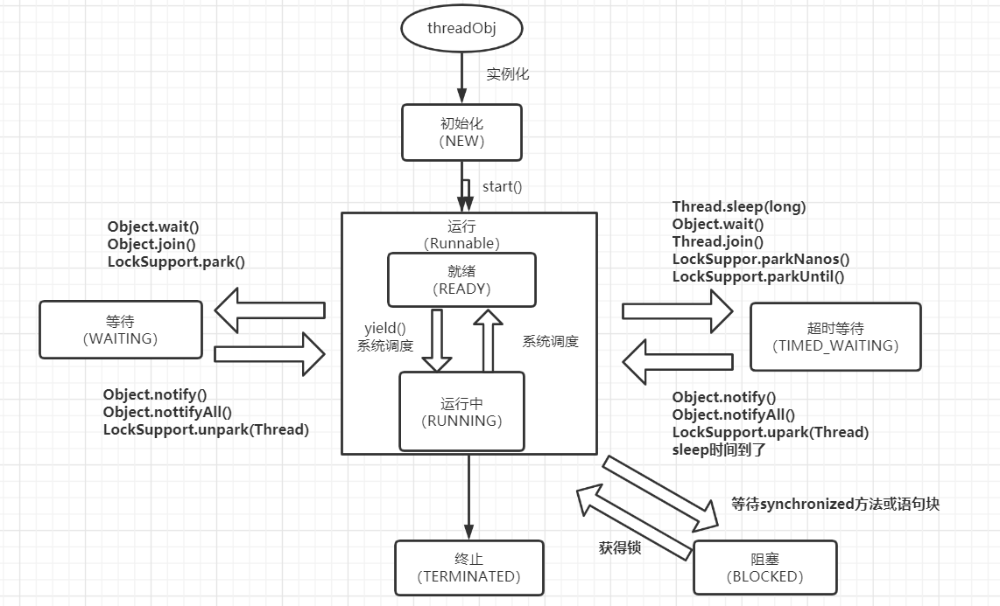

### 线程

#### 线程的几种状态

***

>**线程状态图**
>
>
>
>​		
>
>​		
>
>**新生态（New）：**一个线程已经被开启，但是还没有调用 start() 方法
>
>**运行态（RUNNABLE）：**运行态，Java线程将操作系统中的就绪和运行两种状态统称为“运行中”。其实 start() 了之后线程是进入了就绪态
>
>**阻塞态（Block）：**一个线程在运行的过程中，受到了某些影响，放弃了已获取到的CPU时间片，并且不再参与CPU时间片的竞争，此时线程处于阻塞状态。例如：IO操作
>
>**等待态(WAITING)：**进入该状态表示当前线程需要等待其他线程做出一些特定动作才能返回就绪态（通知）
>
>**超时等待状态（TIME_WAITING）：**不同于WAITING，可以在指定时间自行返回到就绪态
>
>**终止态(TERMINATED)：**线程运行结束，被销毁
>
>​						
>
>​						
>
>**WAITING和BLOCKED的区别**
>
>waiting和blocked都表示暂停执行当前线程。两者的区别在于waiting是主动停止的，需要其他线程唤醒；而blocked是被动停止的，条件允许后会自动调度blocked的线程。线程进入waiting状态时会释放锁，而blocked不会释放锁。其实也很容易记忆，blocked有可能是IO造成的，当线程想要申请IO资源的时候读写数据的时候，肯定不能释放锁反而让其他线程先读写数据吧。	

***

​					

​					

​				

#### 创建线程的几种方式

****

> **在Java中创建线程一般有三种方式**
>
> * 继承Thread类，重写run方法
>
> * 实现Runnable接口
>
> * 使用匿名内部类或者lambda表达式
>
> * 再加一种，使用线程池
>
>   ​		
>
> **实例代码**
>
> ```java
> // 开启线程的几种方式
> public class Test1 {
>     public static void main(String[] args) {
>         // 继承Thread类
>         Thread workThread1 = new WorkThread1();
>         workThread1.start();  
> 
>         // 实现Runnable接口
>         Thread workThread2 = new Thread(new WorkThread2());
>         workThread2.start();
> 
>         // 使用匿名内部类
>         Thread workThread3 = new Thread(new Runnable() {
>             @Override 
>             public void run() { 
>                 System.out.println("我是使用匿名内部类的线程");
>             }
>         });
>         workThread3.start();
> 
>         // 使用lambda表达式
>         Thread workThread4 = new Thread(()->{
>             System.out.println("我是使用lambda表达式的线程");
>         });
>         workThread4.start();
> 
>         System.out.println("我是主线程");
>     }
> 
>     
>     static class WorkThread1 extends Thread{
>         @Override
>         public void run() {
>             System.out.println("我是继承Thread类的线程");
>         }
>     }
> 
>     static class WorkThread2 implements Runnable {
>         @Override
>         public void run() {
>             System.out.println("我是实现Runnable接口的线程");
>         }
>     }
> }
> ```

***

​					

​						

​				

#### 终止线程的几种方式

***

> * run方法正常运行结束
>
> * 使用标志退出线程
>
> * interrupt方法
>
>   ```java
>   public class TestThread3 {
>       static volatile boolean flag = true;
>       public static void main(String[] args) throws Exception {
>           // run方法运行完毕正常退出
>           new Thread(()->{
>               System.out.println("这句话运行完了就正常退出了");
>           }).start();
>   
>           // 使用标志退出线程
>           new Thread(()->{
>               while(flag)
>                   System.out.println("当flag值为false的时候就退出");
>           }).start();
>           TimeUnit.MICROSECONDS.sleep(1);
>           flag = false;
>   
>           // 使用中断退出
>           Thread thread = new Thread(()->{
>               try{
>                   TimeUnit.SECONDS.sleep(500); // 让线程进入阻塞状态
>             } catch(InterruptedException e) {
>                   System.out.println("我被中断退出了");
>             }
>           });
>           thread.start();
>           System.out.println("500s内按任意按键中断线程！");
>           System.in.read();
>           thread.interrupt();    // 中断线程
>           thread.join();
>           System.out.println("主线程退出了");
>       }
>   }
>   ```

***

​				

​					

​				

#### 线程中一些常用的方法

****

> **wait()**
>
> * 让当前线程进入等待状态，直到另一个线程调用 notify() 或 notifyAll() 方法，wait() 也会释放当前线程所持有的锁
>
>
> * **notify() 和 notifyAll()**
>
>   * 唤醒正在等待同一把锁的线程，notify() 是只唤醒一个线程，而 notifyAll() 是唤醒所有在等待那把锁的线程，使线程进入就绪状态
>
>     ​		
>
> **yield()**
>
> * 让当前线程暂停，但不会阻塞该线程，而是由运行状态进入到就绪状态。该方法主要是用于防止线程过度占用CPU，一般很少用到该方法
>
> * yield() 方法不会释放锁
>
>   ​			
>
> **sleep()**
>
> * 让当前线程进入阻塞态
>
> * sleep(long millis) 让当前正在执行的线程暂停millis毫秒，并进入阻塞态，该方法受到系统计时器和线程调度器的精度和准度的影响。让当前正在执行的线程暂停millis毫秒，并进入阻塞状态
>
> * sleep() 方法不会释放锁
>
>   ​		
>
> **join()**
>
> * 当某个程序执行流中调用其他线程的join方法时，调用线程将被阻塞，直到被join的线程执行完毕。即当前线程内，用某个线程对象调用join()后，会使当前线程等待，直到该线程对象的线程运行完毕，原线程才会继续运行。
>
> * 相当于你在饭堂打饭，然后你让你的同学插队到你前面，你就必须等你同学打完饭才能轮到你。
>
>   ​		
>
> **interrupt()**
>
> * 用于中断线程。这个方法被调用时，会立即将线程的中断标志设置为true。当中断处于阻塞态的线程时，由于处于阻塞状态，中断标记会被设置为false，抛出一个 InterruptedException。interrupt()方法只是改变中断状态，不会中断一个正在运行的线程。需要用户自己去监视线程的状态为并做处理。线程的中断标志被设为中断状态之后就会抛出中断异常，所以我们在线程的循环外捕获这个异常，就可以退出线程了。
>
> * interrupt() 并不会中断处于运行态的线程，它会把线程的中断标记设置为true，我们可以不断通过 isInterrupted() 来检测中断标记，从而在调用了interrupt()后终止线程，这也是通常我们对interrupt()的用法
>
>   ​		
>
> **interrupted() 和 isInterrupted()**
>
> * Interrupted() 是Thread类的一个静态方法，它返回一个布尔类型指明当前线程是否已经被中断，isInterrupted() 是Thread类的实例方法，返回一个布尔类型来判断线程是否已经被中断。它们都能够用于检测对象的中断标记。区别是，interrupted()除了返回中断标记之外，它还会清除中断标记(即将中断标记设为false)；而 isInterrupted() 仅仅返回中断标记

****

​				

​				

​						

#### Daemon线程

>* 守护线程，主要用于程序中后台调度以及支持性的工作。当JVM不存在非Daemon线程的时候，JVM将会退出，守护线程也会被终止，且守护线程中的finally语句块不一定有机会得到执行。
>* 如果当前线程是守护线程，那么在这个线程内创建的线程也是守护线程。
>* 在创建线程的时候，通过 setDaemon(true) 指定为守护线程，且设置守护线程语句要在 start() 之前执行。

​					

​					

​						

**Java中的线程中断是什么意思**

* Java中的线程中断只是一个状态，true表示已中断，false表示未中断。设置线程中断不影响线程的继续执行，但是线程设置中断后，线程内调用了wait、join、sleep方法中的一种， 立马抛出一个 InterruptedException，且中断标志被清除，重新设置为false

* 线程的中断标志应该是记录在虚拟机中的，因为翻看Thread源码没有找到像中断标志的属性。查看 interrupt() 方法的源码可知，最终会调用 interrupt0() 方法设置中断标志，这个 interrupt0() 方法是native方法。所以其中断标志应该是虚拟机自己记录实现的。

  ```java
  public void interrupt() {
      if (this != Thread.currentThread())
          checkAccess();
      synchronized (blockerLock) {
          Interruptible b = blocker;
          if (b != null) {
              interrupt0();         // Just to set the interrupt flag，
  			b.interrupt(this);    // 上面这句话是源码的注释
              return;
          }
      }
      interrupt0();
  }
  
  private native void interrupt0();    // native方法
  ```

  ​		
  
  ​		
  
  ​		

