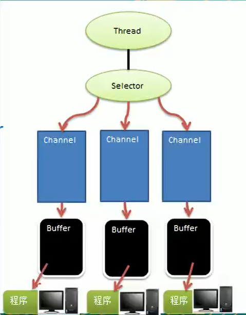
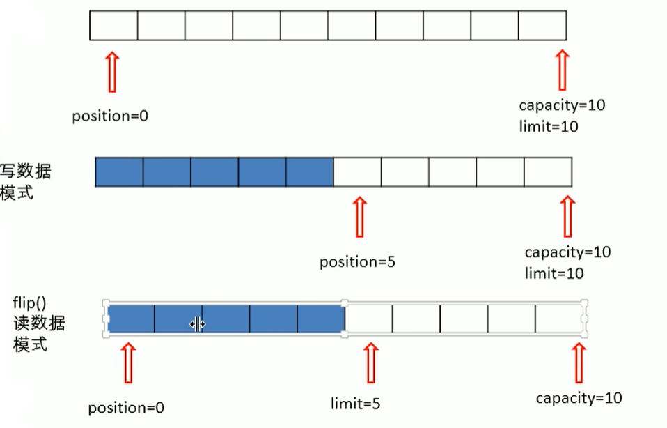
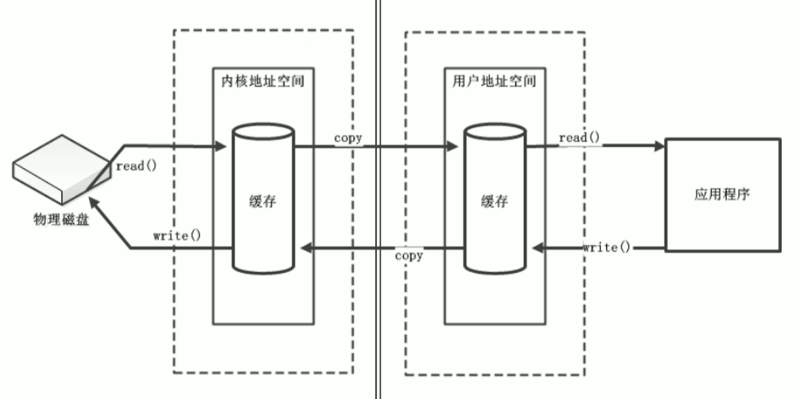
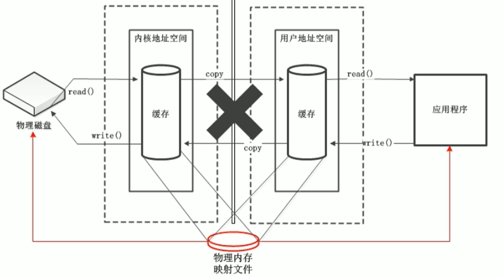
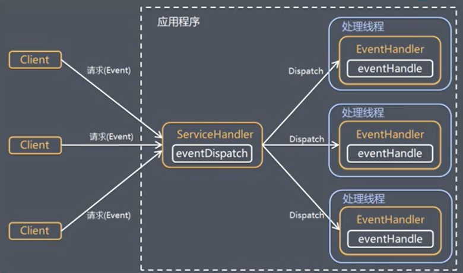

## Netty

### Netty是什么

* Netty是一个异步的，基于事件驱动的网络应用框架，用以快速开发高性能、高可靠性的网络IO框架。

* Netty主要针对在TCP协议下，面向Clients端的高并发应用，或者P2P场景下的大量数据持续传输的应用。

* Netty本质是一个NIO框架，适用于服务器通讯相关的多种应用场景。

  ​	

### NIO

> * Java NIO 全称 java non-blocking IO，是指 JDK 提供的新API。从 JDK 1.4 开始，Java提供了一系列改进的输入 / 输出的新特性，被统称为NIO（即New IO) ，是同步非阻塞的。
>
> * NIO相关类都被放在java.nio包及子包下。
>
> * NIO有三大核心：**Channel（通道），Buffer（缓冲区），Selector（选择器）**；
>
> * NIO是面向缓冲区编程的。数据读取到一个稍后处理的缓冲区，需要时可在缓冲区中前后移动，这就增加了处理过程中的灵活性，使用它可以提供非阻塞式的高伸缩性网络。
>
>   ​	
>
> **NIO和BIO的区别**
>
> * BIO以流的方式处理数据，而NIO以块的方式处理数据，块I/O的效率比流I/O高很多。
>
> * BIO基于字节流和字符流进行操作。而NIO基于Channel和Buffer进行操作，数据总是从通道读取到缓冲区，或者从缓冲区写入到通道中。Selector用于监听多个通道的事件（例如：连接请求，数据到达），因此使用单个线程就可以监听多个客户端通道。
>
> * NIO的核心在于通道 (Channel) 和缓冲区 (BUffer) 。**通道表示打开到IO设备的连接，如果要使用NIO，需要获取用于连接IO设备的通道以及用于容纳数据的缓冲区。操作缓冲区，对数据进行处理。J简而言之，Channel负责传输，Buffe负责存储**
>
>   ​	
>
> **NIO三大核心组件关系图**
>
> 
>
> **关系说明**
>
> * 每个Channel都对应一个Buffer
> * 一个Selector对应一个线程，一个线程可以有多个Channel（Channel可以理解为一个连接)。Channel要注册到Selector中，该图中，有三个Channel注册到了Selector中
> * 程序切换到哪个Channel是由事件决定的，Event是一个重要的概念。Selector会根据不同的事件，在各个Channel上切换
> * Buffer可以理解为一个内存块，底层是一个数组，数据的读取写入要通过Buffer。而在BIO中都是通过单向的输入流或者输出流。但是NIO的Buffer是可读写的，需要通过flip方法切换。
> * Channel也是双向的，可以返回底层操作系统的情况。（Buffer是双向的，Channel也是双向的）
>
> 
>
> **小结：**
>
> - 我们可以对比BIO中的流，BIO中的流要么是只能输入，或是只能输出。
>
> - 而NIO是可以双向的。通俗的理解，NIO的操作就是通过Channel怼到一个文件上，而Channel就相当于一条管道。每个管道都需要有一个运输工来搬运数据，这个运输工就是Buffer。
> - Selector就是用来管理这些Channel的管理器。


​	

### 三大组件


​			

#### Buffer

>* 在Java NIO中，Buffer就是负责数据的存取。缓冲区本质上就是数组，用于存储不同类型的数据。所以就衍生出了不同类型的缓冲区。Java中提供除了boolean以外的所有基本类型的缓冲区。如：ByteBuffer、CharBuffer、ShortBuffer、IntBuffer等。
>
>* NIO中所有的XXXBuffer都继承自Buffer，而Buffer类中有几个属性需要我们熟知
>
>  ```java
>  // 标记，表示记录当前position的位置；通过mark()方法，将pos当前位置保存到mark中，调用reset()将pos指向mark保存的位置
>  private int mark = -1;			
>  
>  // 位置，表示缓冲区中正在操作数据的位置
>  private int position = 0;		
>  
>  // 界限，表示缓冲区中可以操作数据的大小。即，limit后的数据不能进行读写
>  private int limit;				
>  
>  // 容量，表示缓冲区中最大存储数据的额容量。一旦声明不能改变
>  private int capacity;			
>  
>  
>  // 所以它们之间的关系应该是：0 <= mark <= position <= limit <= capacity
>  ```
>
>  ​	
>
>**小案例**
>
>```java
>@Test
>public void test() {
>    ByteBuffer buf = ByteBuffer.allocate(10);		// 创建一个10个字节大小的缓冲区
>    System.out.println(buf.position());				
>    System.out.println(buf.limit());
>    System.out.println(buf.capacity());
>    // 打印：pos_0、limit_10、capacity_10；默认初始化值
>
>    buf.put("fffff".getBytes());			// 向缓冲区中写入五个字符
>    System.out.println(buf.position());				
>    System.out.println(buf.limit());
>    System.out.println(buf.capacity());
>    // 打印：pos_5、limit_10、capacity_10；
>    
>    
>    buf.flip();	// 反转缓冲区，将缓冲区置为读状态。缓冲区是双向的可读写，但是需要通过这个方法切换
>    
>    System.out.println(buf.position());				
>    System.out.println(buf.limit());
>    System.out.println(buf.capacity());
>    // 打印：pos_0、limit_5、capacity_10；
>    
>    // rewind();    // 重新读，也就是把pos指针重新指向到数据最开始的位置
>    // clear();		// 清空缓冲区，但实际上并没有真正清空，只是初始化一下pos、limit的位置。写的时候直接覆盖之前的数据
>}
>```
>
>​			
>
>**上述案例示意图**
>
>
>
>**小结：**
>
>* 写模式时，默认pos指向当前数据的末尾端。
>
>* 读模式时，pos指向最前面，limit就是数据的长度，而limit之后，数据就是不可读的。
>
>  ​		
>
>  ​	
>
>**直接缓冲区与非直接缓冲区**
>
>* 非直接缓冲区：
>
>  * 需要拷贝内核空间中文件数据的缓冲区
>
>  * 通过allocate() 方法分配，将缓冲区建立在 JVM 的内存中
>
>    
>
>    ​	
>
>* 直接缓冲区
>
>  * 无需拷贝内核空间中文件数据的缓冲区 
>
>  * 通过allocateDirect() 方法分配的缓冲区，将缓冲区建立在物理内存中。提高了效率
>
>    
>
>    


​				

#### Channel

>* Channel即通道，可以通俗的理解为打开的连接
>* 通道类似于流，但通道本身不能直接访问数据，Channel只能与Buffer进行交互
>* 通道和流的区别如下
>  * 通道可以同时进行读写，而流只能读或者只能写
>  * 通道可以实现异步读写数据
>  * 通道可以从缓冲读数据，也可以写数据到缓冲，通道是双向的，而流只是单向的
>* read，从通道读取数据并发到缓冲区中
>* write，把缓冲区的数据写到通道中
>
>

​			

#### Selector

​		

​		

​		

​		

### 线程模型

**Reactor线程模型**，也就是传统的网络IO模型，基于事件驱动，又叫做反应模型，分派模型，通知模型

Reactor的三种具体实现

* 单Reactor单线程
  * 一个ServerSocket，接收了一个请求就处理这个请求。处理完之后，等待下一次
* 单Reactor多线程
  * 一个ServerSocket，接受了一个请求之后。创建一个线程，或者从线程池中拿到一个新的线程处理请求。
* 主从Reactor多线程





